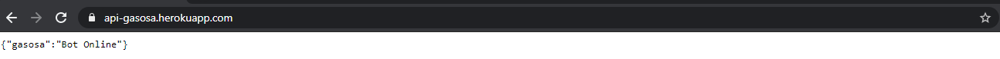

# Adonis API application

This is the boilerplate for creating an API server in AdonisJs, it comes pre-configured with.

<<<<<<< HEAD
1. Bodyparser
2. Authentication
3. CORS
4. Lucid ORM
5. Migrations and seeds

## Setup
=======
<br>

<h1 align="center">
    
</h1>

<h2 title='#projeto'>
    Projeto
</h2>

Back-end para o Gasosa, um aplicativo para preços de combustíveis. Foi criado um Bot responsável por colher informações de determinadas cidades em horários programados.
>>>>>>> 969692b81a8a4d745be09216135731c8e36c0b4e

Use the adonis command to install the blueprint

```bash
adonis new yardstick --api-only
```

or manually clone the repo and then run `npm install`.


### Migrations

Run the following command to run startup migrations.

```js
adonis migration:run
```
