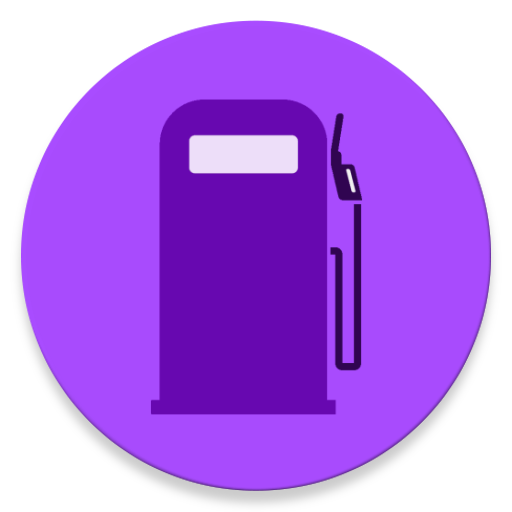
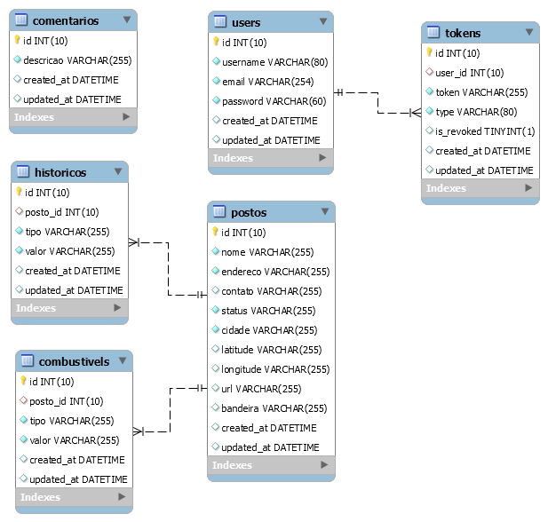

 

<h1 align='center'>
      
</h1>

 
<h2 title='#projeto'>
    Projeto
</h2>

Back-end para o Gasosa, um aplicativo para preços de combustíveis.

<h2 title='#tecnologias'>
    Tecnologias
</h2>

Esse projeto foi desenvolvido com as seguintes tecnologias:

- AdonisJS

<h2 title='#bibliotecas'>
    Bibliotecas
</h2>

Foram utilizadas as seguintes bibliotecas:

- puppeteer
- axios

<h2 title='#bibliotecas'>
   Documentação 
</h2>

- Detalhes para [Api](https://documenter.getpostman.com/view/1402289/SzzheyS6?version=latest)

<h2 title='#bibliotecas'>
   Banco de dados
</h2>

<h1 align="center">
    
</h1>

- Histórico: é salvo todas as informações sobre os postos deixando um histórico detalhado dos preços.
- Combustíveis: é atualizado o valor do combustível para ser visualizado. Exemplo último preço da gasolina comum em determinado posto.
- Posto: informações referentes aos postos adicionados na aplicação.
- Comentário: caso os usuários desejam fazer alguma sugestão, etc.
