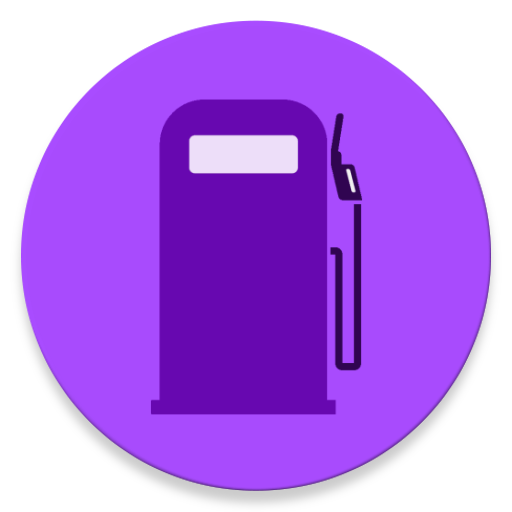
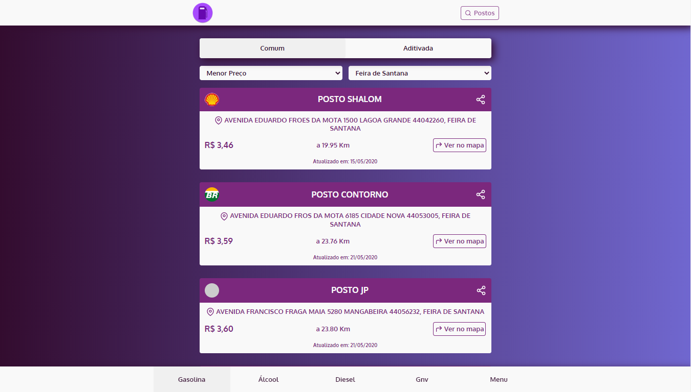

 

<h1 align='center'>
      
</h1>

 

<h1 align="center">
    
</h1>

<h2 title='#projeto'>
    Projeto
</h2>

Interface web para o Gasosa, um aplicativo para preços de combustíveis.

<h2 title='#tecnologias'>
    Tecnologias
</h2>

Esse projeto foi desenvolvido com as seguintes tecnologias:

- Reactjs

<h2 title='#bibliotecas'>
    Bibliotecas
</h2>

Foram utilizadas as seguintes bibliotecas:

- react-router-dom
- react-icons
- axios
- bootstrap
- react-bootstrap
- react-share

